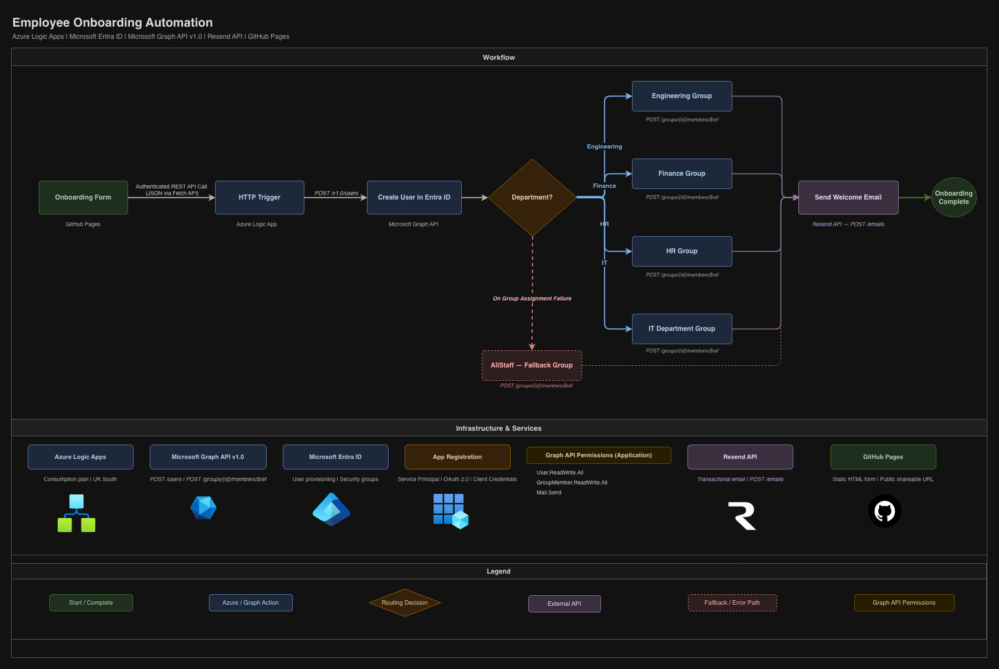

# Employee Onboarding Automation

Automated employee onboarding system built on Azure Logic Apps and Microsoft Entra ID. When a new employee's details are submitted via a web form, the workflow automatically provisions an Entra ID account, assigns the user to the correct department security group, and sends a welcome email with their login credentials.

---

## Architecture



The diagram illustrates the full end-to-end workflow: a GitHub Pages form submits employee details via an authenticated REST API call to an Azure Logic App HTTP trigger, which provisions the user in Entra ID via Microsoft Graph API, routes them to their department security group, and sends a welcome email via Resend API.

---

## Overview

This project replaces a manual IT onboarding process with a fully automated workflow. HR or a line manager fills in a simple web form and the system handles everything end to end — no IT involvement required for routine account creation.

**What it does:**

- Creates a new user account in Microsoft Entra ID with all standard attributes
- Assigns the user to the correct security group based on their department (Engineering, Finance, HR, IT)
- Falls back to an AllStaff group if the department group assignment fails for any reason
- Sends a welcome email to the employee's personal address with their username and temporary password

---

## Tech Stack

| Component | Service |
|---|---|
| Workflow engine | Azure Logic Apps (Consumption) |
| Identity provider | Microsoft Entra ID |
| Graph API | Microsoft Graph v1.0 |
| Authentication | App Registration (Service Principal / OAuth 2.0) |
| Email delivery | Resend API |
| Onboarding form | GitHub Pages (HTML/CSS/JS) |

---

## Repository Structure

```
/
├── README.md                  — This file
├── architecture.png           — Architecture diagram
├── architecture.drawio        — Editable architecture diagram (draw.io)
├── onboarding-form.html       — Web form hosted on GitHub Pages
└── logic-app-workflow.json    — Logic App workflow definition (sanitised)
```

---

## How It Works

```
1. User submits form on GitHub Pages
         |
         | Authenticated REST API Call (JSON via Fetch API)
         v
2. Azure Logic App HTTP Trigger receives payload
         |
         | POST /v1.0/users
         v
3. Microsoft Graph API creates user in Entra ID
         |
         | Department routing (If condition)
         v
4. User added to department security group
         |-- Engineering  →  POST /groups/{id}/members/$ref
         |-- Finance      →  POST /groups/{id}/members/$ref
         |-- HR           →  POST /groups/{id}/members/$ref
         |-- IT           →  POST /groups/{id}/members/$ref
         |-- (failure)    →  AllStaff fallback group (dashed path)
         |
         | POST /emails
         v
5. Welcome email sent to employee's personal address via Resend API
```

---

## Prerequisites

Before deploying, you need:

- An Azure subscription
- A Microsoft Entra ID tenant
- An app registration with the following **application permissions** granted with admin consent:
  - `User.ReadWrite.All`
  - `GroupMember.ReadWrite.All`
  - `Mail.Send`
- A [Resend](https://resend.com) account and API key
- Four security groups created in Entra ID (Engineering, Finance, HR, IT)
- An AllStaff security group for fallback assignment

---

## Deployment

### 1. App Registration

1. Go to **Entra ID > App registrations > New registration**
2. Name it `logic-app-onboarding` — select **Single tenant**
3. Go to **API permissions > Add a permission > Microsoft Graph > Application permissions**
4. Add `User.ReadWrite.All`, `GroupMember.ReadWrite.All`, `Mail.Send`
5. Click **Grant admin consent**
6. Go to **Certificates & secrets > New client secret** — copy the **Value** (not the ID)
7. Note your **Application (client) ID** and **Directory (tenant) ID**

### 2. Logic App

1. Create a **Logic App (Consumption)** in the Azure portal in your preferred region
2. Open the workflow in **Code view**
3. Paste the contents of `logic-app-workflow.json`
4. Update the following values throughout the file:
   - `tenant` — your tenant ID
   - `clientId` — your app registration client ID
   - `secret` — your client secret value
   - Security group object IDs (Engineering, Finance, HR, IT, AllStaff)
   - `@yourdomain.onmicrosoft.com` — your tenant's onmicrosoft domain
5. Save the workflow
6. Copy the **HTTP trigger URL** from the trigger overview

### 3. Onboarding Form

1. Open `onboarding-form.html`
2. Replace `PASTE_YOUR_LOGIC_APP_TRIGGER_URL_HERE` with the trigger URL from step 2
3. Push to the `main` branch of this repository
4. Enable **GitHub Pages** under Settings > Pages (source: main branch, root folder)
5. Your form will be live at `https://yourusername.github.io/your-repo-name/onboarding-form.html`

---

## Form Fields

| Field | Description | Maps to |
|---|---|---|
| First name | Employee's given name | `givenName`, `mailNickname`, `userPrincipalName` |
| Last name | Employee's family name | `surname`, `mailNickname`, `userPrincipalName` |
| Job title | Role title | `jobTitle` |
| Department | Engineering / Finance / HR / IT | `department` + security group routing |
| Personal email | Used for welcome email delivery | `otherMails`, Resend recipient |

---

## Security Group Routing

The workflow evaluates the submitted department value and adds the user to the corresponding Entra ID security group:

| Department | Target Group | Fallback |
|---|---|---|
| Engineering | Engineering security group | AllStaff |
| Finance | Finance security group | AllStaff |
| HR | HR security group | AllStaff |
| IT | IT Department security group | AllStaff |

The AllStaff fallback triggers if the primary group assignment fails for any reason (transient Graph API error, group deleted, permissions issue). This ensures every provisioned user is always in at least one group.

---

## Graph API Permissions

The app registration requires the following **application permissions** with admin consent granted:

| Permission | Purpose |
|---|---|
| `User.ReadWrite.All` | Create and manage user accounts in Entra ID |
| `GroupMember.ReadWrite.All` | Add users to security groups |
| `Mail.Send` | Send email on behalf of a mailbox (if using Graph for email) |

Authentication uses the **Client Credentials** OAuth 2.0 flow via the app registration service principal. The Logic App is not tied to any individual user account.

---

## User Account Details

All created accounts use the following conventions:

- **UPN format:** `firstname.lastname@yourdomain.onmicrosoft.com`
- **Display name:** `Firstname Lastname`
- **Temporary password:** Set at provisioning — user is forced to change on first login (`forceChangePasswordNextSignIn: true`)
- **Account status:** Enabled immediately on creation

---

## Welcome Email

The employee receives an email to their personal address containing:

- Their assigned username (UPN)
- Their temporary password
- Instructions to log in and change their password immediately

---

## Security Considerations

- The Logic App authenticates to Microsoft Graph using a **Service Principal** (application permissions), not a delegated user account. This means the workflow is not tied to any individual's account and will not break if staff leave or MFA states change.
- Client secrets should be rotated regularly. Set a calendar reminder to rotate before expiry.
- The temporary password in the workflow definition should be treated as a secret. Consider moving it to an Azure Key Vault reference for production use.
- The GitHub Pages form does not store any data — it only POSTs to the Logic App trigger URL and displays the response.
- The Logic App trigger URL contains a SAS token. Treat it as a secret and do not commit it to a public repository without access controls.
- The sanitised `logic-app-workflow.json` in this repository has all secrets replaced with placeholder values. Never commit live credentials to version control.

---

## Known Limitations

- Resend free tier sends from `onboarding@resend.dev`. For production, verify a custom domain in Resend and update the `from` field in the workflow.
- The onmicrosoft.com domain is used for UPNs. If your organisation has a verified custom domain in Entra ID, update the UPN suffix accordingly.
- Guest accounts in Entra ID cannot send email via Graph API. A licensed member account or a third-party email provider such as Resend is required for email delivery.

---

## Potential Enhancements

- Add Azure Key Vault integration to store the client secret and Resend API key securely
- Add a Response action to the HTTP trigger to return a proper success/failure message to the form
- Extend department routing to additional groups
- Add a manager notification email on successful provisioning
- Integrate with Microsoft Teams to post a welcome message to a new starters channel
- Add input validation in the Logic App to reject malformed requests before attempting user creation
- Move the onboarding form behind authentication so only authorised staff can submit it

---

## Built With

- [Azure Logic Apps](https://learn.microsoft.com/en-us/azure/logic-apps/)
- [Microsoft Graph API](https://learn.microsoft.com/en-us/graph/overview)
- [Microsoft Entra ID](https://learn.microsoft.com/en-us/entra/identity/)
- [Resend](https://resend.com)
- [GitHub Pages](https://pages.github.com)
